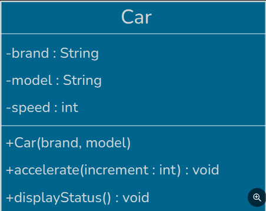
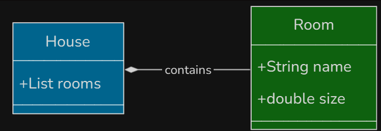

## OOP 
 OOP（object-oriented program）： organized software design around data and object rather than functions and logic.

>benfit: compare to proceduaral programming; modularity and reusability(模块化和可复用性); maintainability（可维护性）; scalability（可扩展性）

> language: Java, Python, C++, C#, Rudy, JavaScript, Swift
### class and object
#### class (类)

a template or a recipe - to defines what an object will contain(its data) and what it will be able to do(its behavior) 

>attribute(图上)， methods（图下）

#### object(对象)
the instance of a class, a food(创建出的实体)
* 有独立的数据，独立于其他对象

### enum(枚举)
define constant, type safe
* 枚举后的对象可以包含额外的数据和行为

### interface(接口)
what and how a component should do 
* extensible, testable, loosely coupled (可扩建，可测试，松耦合性【模块化】)

### 四大特性
* encapsulation (封装)
>Encapsulation = Data hiding + Controlled access

将数据和方法分组到一个类，并限制细节访问，通常使用private【getter,setter】, protected, public
* abstraction (抽象)
>Abstraction = Hiding Complexity + Showing Essentials

只展现高级功能，隐藏细节，通常将“是什么”和“如何做” 分开，通过抽象类（子类如何做）；接口，公共API 实现

* inheritance (继承) --
> subclass = parent class(properties + behaviors)

复用性，一般只在"是一个"的情况下使用，而不是"拥有一个"或“使用一个”(用composition)

* polymorphism (多态)
> different object call same method in different way

1. compile-time(static binding)/method overloading 静态 - 运行前
2. runtime (dynamic binding)/method overriding 动态 - 运行时

### oop relationship
* association（关联）
> a object use, communicate, reference another

> a使用b,在UML中用实线，箭头，双头箭头（双向关联）来标识，两个重要观念 directionality(方向性)和multiplicity(多重性/类之间的关联数量)

* aggregation（聚合）
> a class contains other classes for logical grouping only without lifecycle ownership

> a拥有b（弱），在UML中用空心菱形表示，通常a为独立类可单独使用

* composition（组合）

> one part must belong to a whole lifecycle

> a拥有b（强）， 在UML中用实心菱形标识，一荣俱荣一损俱损，无法独立

* dependency（依赖）
> a use b just to perform a task, not to store or own

>a使用b,一般在类需要其他依赖类时使用(Dependency Injection), 接收其他类而不是创建

### 五大原则(solid principle)
* single responsibility principle(SRP,单一职责) 
> 一个类只有因为一个原因而改变，只负责一种工作。（什么工作的人做什么事），当然一个人也可以身兼数职，把控度很关键
* open/closed principle（ocp,开放封闭）
> 软件允许扩展，不允许修改，使用抽象来创造新的接口在原方法上扩充
* liskov substitution principle（lsp,里氏替换）
> 正确的继承准则： 如果一个子类继承了他的基类，那么子类就需要在基类能够使用的任何情况下也能使用。
> 子类重写时应该是有意义的操作，规避抛出异常，满足基类需要的条件，提供基类保证的结果

* interface segregation principle（isp,接口隔离）
> 接口专注自己的功能，根据客户需求设计对应功能的接口！全面性可以用一个类可以实现多个小型接口

* Dependency Inversion Principle（dip,依赖反转）
> 高层模块不依赖于底层模块，两者都应该依赖于抽象概念（接口），具体实施细节依赖于抽象概念，但概念不依赖于实施细节。满足业务需求时应该优先考虑基础模块。